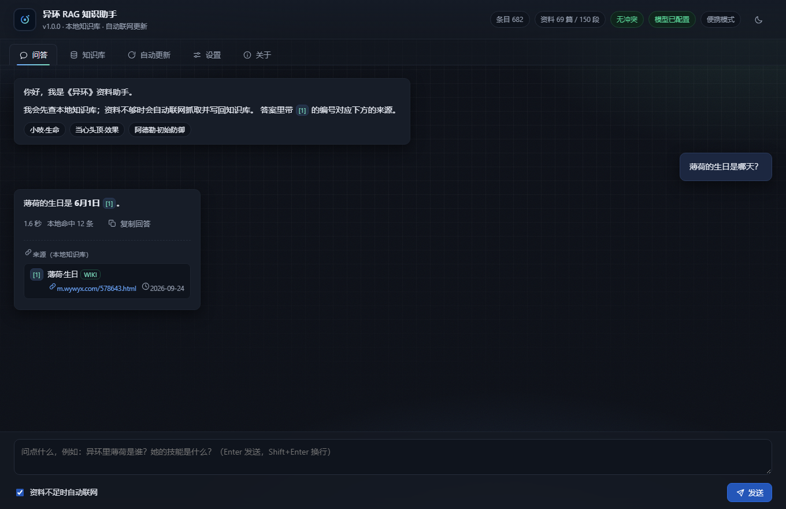
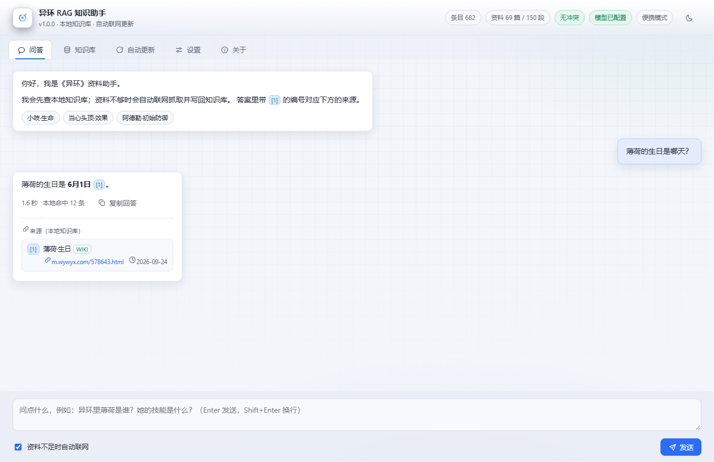
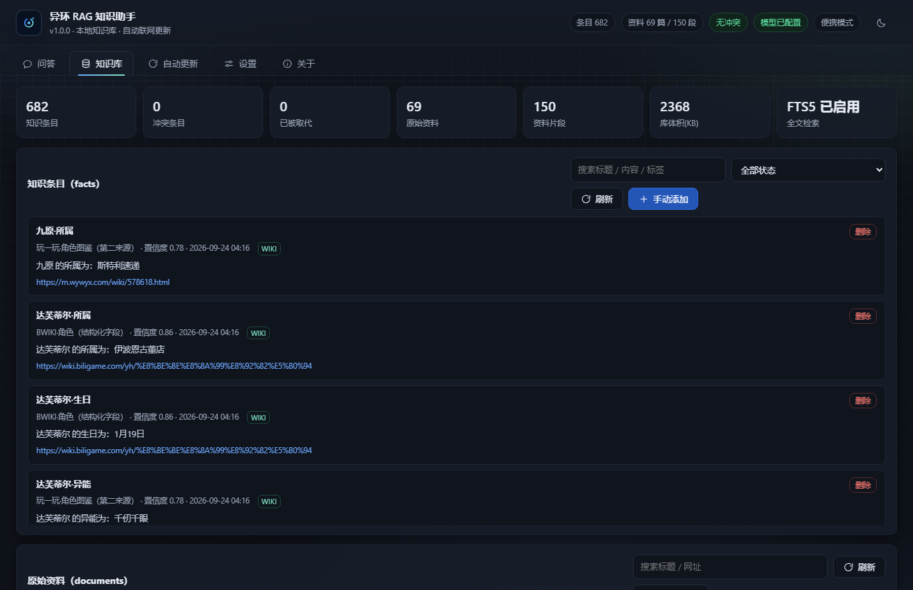
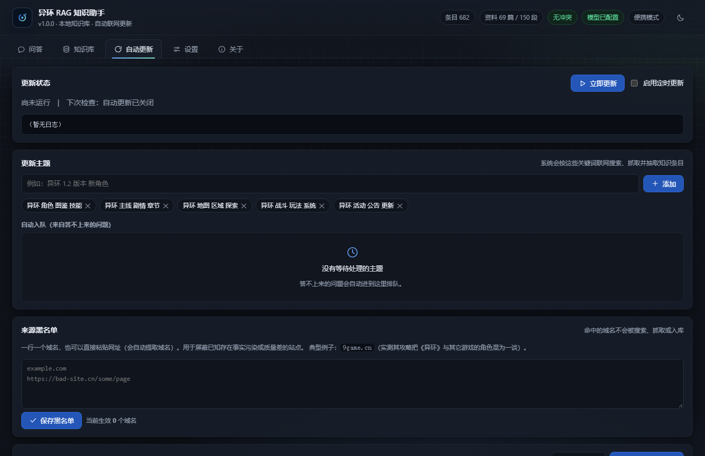
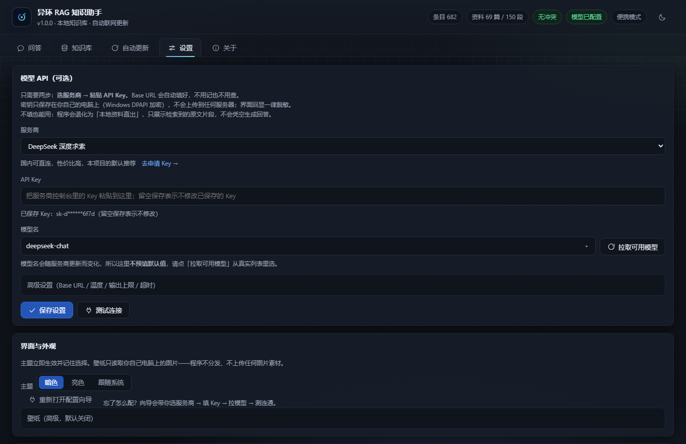
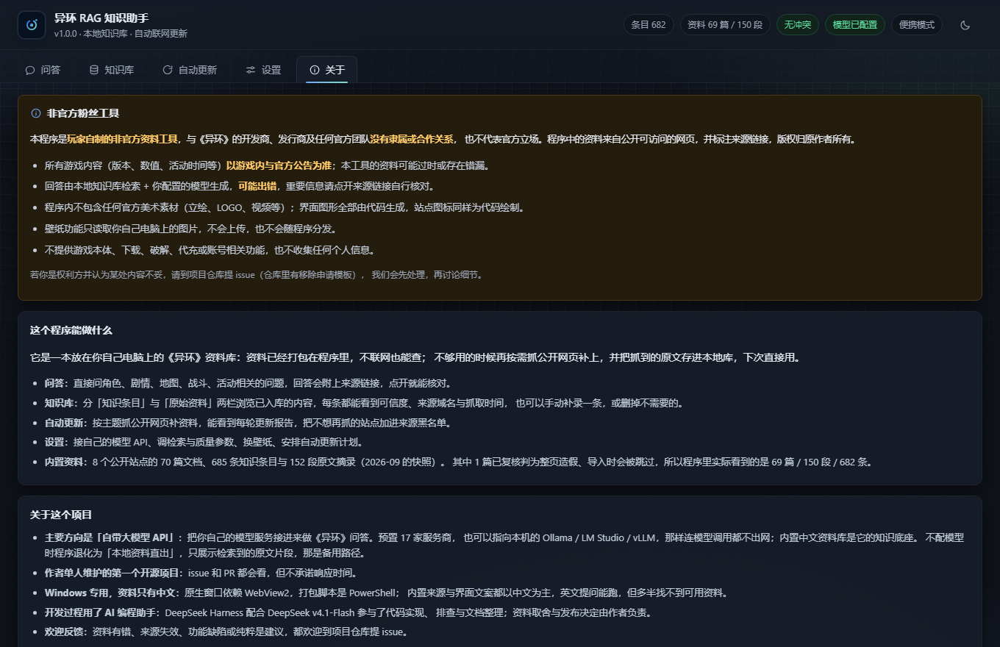
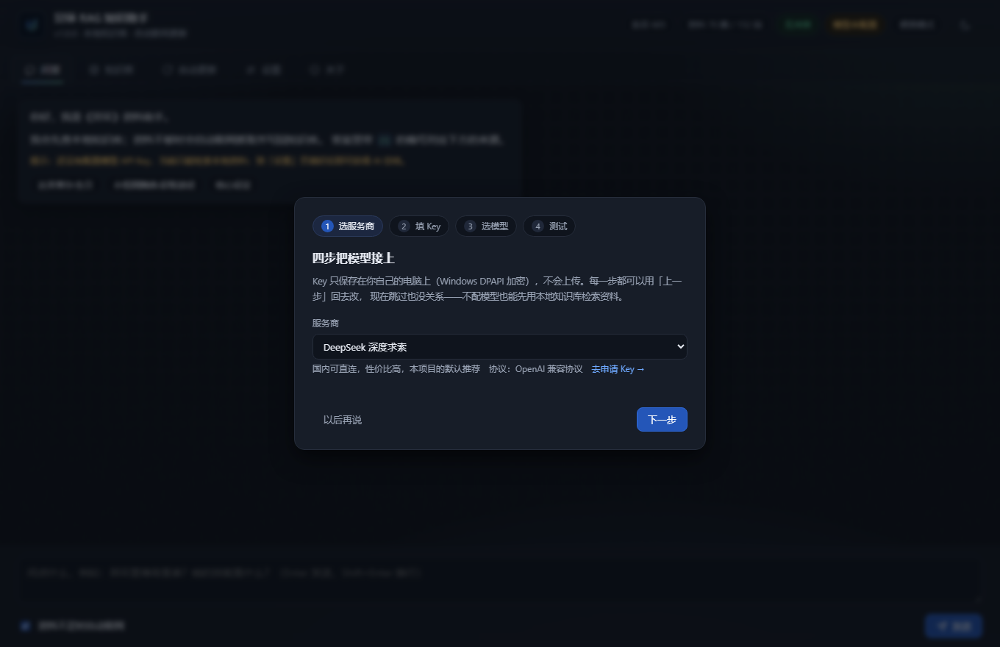

# 异环 RAG 知识助手（Neverness to Everness / NTE）

> 这一版的定位是中文工具：内置资料、内置来源与检索流程都以中文为主，
> 英文界面（以及英文提问）不会带来可用的英文资料。
> **English readers: see [README.en.md](README.en.md)** —— the English file is a summary;
> this Chinese file is the authoritative document.

> **发布状态（2026-09-24）**：功能已冻结，自测 **698** 项全绿
> （`.venv\Scripts\python.exe tools\quality_check.py`），安装包已构建并逐项验证。

一个单文件、免安装的《异环》（Neverness to Everness，英文缩写 NTE）知识库问答工具。
核心是接入你自己选定的大模型 API：云端服务商随便挑，也可以指向本机模型服务
（Ollama / LM Studio / vLLM），把模型调用也留在本机。内置的中文资料库是它的知识底座，
资料不足时会自动联网搜索、抓取，并把新知识写回本地知识库，下一次同样的问题就能直接用本地资料回答。

- **自带大模型 API**：预置 17 家服务商（国内直连 / 海外 / 本地自建），也可以指向本机模型服务；
  不配模型时退化为「本地资料直出」，仍然查得到原文（备用路径，不是主用法）
- 打包为一个 exe，双击即用，不需要安装 Python 或任何依赖
- 不含任何开发者的 API Key，密钥只保存在用户自己的电脑上（Windows DPAPI 加密）
- 支持便携模式：数据和知识库跟着 exe 走，整个文件夹拷进 U 盘即可带走
- 仓库名 `nte-rag`；`yihuan`、`NTE`、`Neverness to Everness` 都是同一款游戏，三种搜法都能找到本项目

---

## 目录

- [English summary](README.en.md)
- [界面预览](#界面预览)
- [使用说明](#使用说明)
- [功能说明](#功能说明)
- [界面与外观](#界面与外观)
- [开发方式](#开发方式)
- [安全与隐私](#安全与隐私)
- [数据来源](#数据来源)
- [开发速查](#开发速查)
- [常见问题](#常见问题)
- [关于本项目](#关于本项目)
- [已知限制](#已知限制)
- [第三方内容与许可](THIRD_PARTY_NOTICES.md) ｜ [内置资料授权与移除](DATA_LICENSE.md)
- [开发、打包与踩坑记录（完整版）](docs/development.md) ｜ [架构说明](docs/architecture.md) ｜ [评测集](eval/README.md)

---

## 界面预览

以下截图由 `tools/make_readme_shots.py` 驱动无头浏览器，从实际运行的本地服务逐张截取。
深色/浅色主题和页面上的数据都来自程序本身，不是设计稿：

| 问答（深色） | 问答（浅色） |
|---|---|
|  |  |

| 知识库 | 自动更新 |
|---|---|
|  |  |

| 设置 | 关于 |
|---|---|
|  |  |

### 首次使用向导

空知识库启动时会先走一个四步向导（选服务商 → 填 Key → 拉模型 → 测试连通）：



---

## 使用说明

### 1. 下载

发行版放在仓库的 Releases 页面（<https://github.com/chaly27yhy/nte-rag/releases>）：

1. **推荐**下载 `NTE-RAG-onedir.zip`，解压得到 `NTE-RAG\` 文件夹，双击里面的 `NTE-RAG.exe`。
2. 也可以下载单文件版 `NTE-RAG.exe`：免解压，但首次启动要把自身解包到临时目录，容易被安全软件或企业策略拦。
3. 校验：两个产物的 SHA-256 与体积写在下面的[发布产物与哈希校验](#发布产物与哈希校验)一节，Release 说明里也各有一份。

| 前置条件 | 说明 |
|---|---|
| 系统 | Windows 10 / 11（代码里没有任何 macOS / Linux 路径） |
| 运行发行版 | 什么都不用装：不含 Python，也不需要手动装 VC++ 运行库 |
| 界面渲染 | 用系统自带的 Microsoft Edge WebView2 运行时；缺了会自动改用默认浏览器打开，不会静默失败 |
| 从源码运行 | Python 3.12、PowerShell 5.1、PyInstaller，步骤见 [开发方式](#开发方式) 与 [docs/development.md](docs/development.md) |

### 2. 运行

本项目有两种交付形态，功能完全一致，都无需安装 Python 或任何依赖：

| 形态 | 产物 | 说明 |
|---|---|---|
| 单文件版（推荐分发） | `dist\NTE-RAG.exe`（40.5 MB） | 一个文件拷走即可；启动时会把自身解包到系统临时目录，因此首次启动约 3–8 秒 |
| 便携目录版（兼容性最好） | `dist\NTE-RAG\NTE-RAG.exe` + `_internal\`（合计 92.8 MB，另有 zip 包） | 不需要自解包，启动更快；必须整个文件夹一起拷贝 |

> **如果单文件版打不开**：某些安全软件、企业策略或受限账户环境会阻止单文件版把自身解包到临时目录
> （表现为进程一闪即逝，日志里出现 `Failed to extract VCRUNTIME140.dll ... Permission denied`）。
> 这时请改用**便携目录版**，它不需要解包，兼容性更好。

双击后程序会启动一个只监听本机的本地服务，并打开应用窗口。
首次启动会先探测系统是否支持 WebView2 原生窗口，不支持就自动改用默认浏览器打开（功能一致）。

> 如果系统缺少 WebView2 运行时（极少数老系统），同样会自动改用默认浏览器。

### 3. 配置模型（可选，但推荐）

打开「设置」页，只需要两步：

1. **选服务商** —— 下拉框里预置了 17 个主流服务商，Base URL 会自动填好：

   | 类别 | 预置服务商 |
   |---|---|
   | 国内直连 | DeepSeek、通义千问（阿里云百炼）、Kimi（月之暗面）、智谱 GLM、硅基流动、火山方舟（豆包）、腾讯混元、阶跃星辰、MiniMax、百川智能 |
   | 海外 | OpenAI、Anthropic Claude、Google Gemini |
   | 本地 / 自建 | Ollama、LM Studio、vLLM（含 OneAPI / NewAPI 等兼容网关）、自定义 |

2. **粘贴 API Key** —— 然后点「拉取可用模型」从服务商那里取回当前模型列表直接选，
   再点「测试连接」确认可用，最后「保存设置」。

> **为什么不用手填 Base URL？** 让用户自己填、留空时回落到 OpenAI 官方地址，会出现
> 「填了 DeepSeek 的 Key 却去打 api.openai.com」→ HTTP 401。所以 Base URL 改由服务商预设决定
> （用户填的值优先）。Base URL 仍可在「高级设置」里改，用于中转站或自建网关。

> **为什么模型名要「拉取」而不是写死？** 各家模型迭代很快。同一时期 DeepSeek 的 `/models`
> 接口返回的是 `deepseek-flash`、`deepseek-v4-pro` 两个名字，界面里写死任何一个都会很快过时。
> 拉取后由你从返回的列表里挑。

> 没有配置模型也能用：此时程序会退化为「本地资料直出」模式，直接展示检索到的原文片段。

### 4. 配置联网搜索（建议）

同样在「设置」页。推荐使用博查（Bocha），国内可直连：

1. 到 [open.bochaai.com](https://open.bochaai.com) 申请 Key；
2. 在「联网搜索」区域选择「博查 Bocha」，粘贴 Key，保存。

不填任何搜索 Key 时，程序会用免 Key 的 DuckDuckGo / 必应网页兜底。
在国内网络环境下这两者可能不稳定，建议配置博查。

### 5. 补充知识库

首次使用建议先到「**自动更新**」页：

1. 勾选「官网·世界观与角色设定」「官网·新闻公告列表」「BWIKI·角色图鉴」「萌娘百科·异环」等数据源；
2. 点「抓取选中数据源」，等它跑完（会显示进度）；
3. 之后可以添加自己关心的主题关键词，点「立即更新」，按主题联网补充。

程序默认内置一份种子知识库（70 篇资料 / 152 段原文 / 685 条结构化知识条目，
来自官网设定与公告、BWIKI（含结构化模板字段：角色生日/CV/所属/基础属性、弧盘适用分类与获取途径）、
玩一玩游戏网角色图鉴（生日/异能/战斗定位/初始面板，作为第二来源做交叉验证）、
萌娘百科、游民星空、3DM），装完就能检索和问答，不必等第一次抓取。首次运行时它会自动导入本地库。
> 导入时会按撤回名单跳过 1 篇复核判为整页造假的页面（BWIKI 的「薄荷」页），所以程序里
> 实际看到的是 **69 篇资料 / 150 段原文 / 682 条条目**——种子文件本身仍是上面那 70 / 152 / 685 的快照。
> 685 条是清理过脏数据之后的数字：`tools/data_audit.py` 体检出 BWIKI「薄荷」页把别的游戏
> （《银与血》的角色「莱夏」）的整套技能和早雾的人物故事拼了进来，据此删掉 13 条、给 5 条打「存疑」
> （第 6 条 `九原·CV` 已按维护者裁定更正为正确值并撤下存疑）；
> 另外 2 条公开来源抓不到、但你在游戏里确认过的数据（噬心诡刃满级攻击力 570、限定特刊保底次数）
> 走 `tools/manual_facts.py` 的人工录入层补进种子。细节见 `docs/consistency_review.md`。

### 6. 便携模式（可选）

在 exe 同目录放一个空的 `portable.flag` 文件，数据（配置 + 知识库 + 日志）就会保存在
`该目录/data/` 下，整个文件夹拷到 U 盘即可带走。

不放这个文件时：如果 exe 所在目录可写，也会自动使用便携模式；否则回落到 `%APPDATA%\NTE-RAG`。

---

## 功能说明

| 功能 | 说明 |
|---|---|
| 本地优先检索 | 中文 bigram 分词 + SQLite FTS5，不装模型也能检索原文 |
| 结构化知识条目 | 配置模型后，自动从网页抽取「原子化」知识条目，带主题、标签、置信度 |
| 自动联网补齐 | 本地证据不足时自动搜索 → 抓取 → 抽取 → 入库，再基于新证据作答 |
| 带引用回答 | 每条结论标注来源编号，附来源 URL、来源类型（官方/Wiki/社区）与更新时间 |
| 冲突不覆盖 | 新旧知识冲突时并存并标记 `conflict`，旧的标记 `superseded`，全称可追溯 |
| 数据质量 | 模板噪声逐行剔除、信息密度与视频页判定、跨作品污染检测、字词/字典站与视频页的预置黑名单、社区来源的主题相关性闸门、用户可配来源黑名单、按页面撤回已证伪来源（软撤回，检索层看不到）、官方来源优先裁决；自测 `tools\quality_check.py` 逐条钉住这些规则 |
| 自动更新 | 可以启动时更新、按小时间隔定时更新，也可以手动立即更新；有主题队列与完整日志 |
| 缺口自动入队 | 回答不上来的问题会自动进入主题队列，等待后续自动补齐 |
| 数据可迁移 | 知识库可导出为 JSON；`data/` 目录整体拷贝即可迁移 |
| 断网可用 | 断网时降级为纯本地检索与回答，并明确提示联网失败原因 |
| 界面与外观 | 深色 / 浅色 / 跟随系统三档主题、玻璃拟态顶栏、代码绘制的图标体系；壁纸可选（只读本机图片，可选「完整显示 / 铺满裁切」） |
| 首次使用向导 | 四步引导选服务商 → 填 Key → 拉模型 → 测试连通；支持「上一步」回退与点击步骤条跳回修改，随时可跳过，之后可在「设置」页点「重新打开配置向导」重跑 |

---

## 界面与外观

界面是「自绘 + 令牌化」的：所有视觉资产（图标、favicon、背景网格与噪点、品牌标记）
都由 SVG / CSS 在代码里生成，仓库与分发包里没有任何位图素材。

- **主题**：深色、浅色、跟随系统三档，选择保存在配置里，而不是 localStorage ——
  服务端口随机，按源存的状态会丢。`system` 由 JS 在运行时解析成具体主题，所以用户手动选择总能覆盖。
- **图标**：`app/web/index.html` 顶部有一段内联 SVG sprite（24 个 symbol），
  用法 `<svg class="i"><use href="#i-chat" /></svg>`；改图标只需改 sprite。
- **壁纸（可选）**：只能用你自己电脑上的图片（JPG/PNG/WebP/GIF/BMP，不超过 12 MB）。
  图片经本机接口写入你的数据目录（`wallpaper.*`），不上传任何服务器，也不随程序分发；
  可调遮罩强度保证正文可读，一键清除。
- **壁纸适配方式**：背景分两层。底层用同一张图放大加高斯模糊铺满窗口，补掉留白；
  前景整张居中显示。设置页预览放在 16:9 容器里，用与实际背景相同的
  `background-size: contain` + 居中画法。用 `` + `object-fit` 时，竖图在
  `aspect-ratio` + `max-height` 容器里会退回自然尺寸，被 `overflow: hidden` 裁掉下半截。
  默认「完整显示」，竖图/超宽图都不会只剩中间一条；想铺满窗口可在设置页切到
  「铺满裁切」（`cover`，此时自动关掉模糊底衬）。选择会存进配置（`ui.wallpaper_fit`）。
- **推荐问题每次都随机换**：开场那三颗快捷问题由后端 `GET /api/kb/starter-asks` 从整张 facts 表里
  随机抽（`ORDER BY RANDOM()` + 打乱），并套成问句（「公测时间安排」→「公测时间安排是什么时候？」）。
  其中「最新版本」这类问题由官方公告标题里的版本号最大值生成：1.3 的补丁公告比 1.4 前瞻更新得更晚，
  取第一条会停在 1.3。页面每次打开、抓完新资料、自动更新跑完都会重抽；接口不可用时用兜底问题。
  按钮显示完整标题（`_CHIP_TITLE_MAX = 20` 字以内；超长标题整条跳过、不硬截），窄屏换行显示。
- **无障碍与容错**：统一 `focus-visible` 焦点环、导航有 aria 标签、回答区 `role="log"`；
  报错会翻译成中文并给出下一步建议（没配 Key / 鉴权失败 / 限流 / 超时 / 网络），
  列表为空时给空态提示而不是白屏；生成可随时「停止」，回答可一键复制；点推荐问题把长问题
  填进输入框时，输入框会跟着内容自动长高（上限 40vh），不会再出现「问题只显示上半句」。

> 为什么不用官方立绘做背景？《异环》官方派生作品指引明确禁止
> 「直接复制、扫描、取样、描摹使用官方素材（插画、视频、歌曲、LOGO 等）」，
> 也包括「可能被误认为官方发布」的内容。所以本项目坚持代码绘制 + 用户自备壁纸的路线。
> 相关说明写在「关于」页的免责声明里。

---

## 开发方式

这个项目由作者主导完成，开发与优化过程中使用了 AI 编程助手（DeepSeek Harness
配合 DeepSeek v4.1-Flash）协助：代码实现、缺陷排查、测试补全与文档撰写都有 AI 参与，
数据规则、来源取舍与发布决定由作者拍板。

这会影响到怎么读这份文档：

- 文中给出的自测结论与数字，是同一批开发参与者写下并运行的可复现工程记录，
  不是第三方独立验证。它们的价值在于你可以自己重跑：
  `.venv\Scripts\python.exe tools\quality_check.py`、`.venv\Scripts\python.exe tools\run_eval.py`，或者直接读代码与数据。
- AI 参与不改变任何数据规则：可信度仍由 `app/core/trust.py` 按来源等级 / 提取方式 /
  多源一致性 / 时效派生，冲突仍由人工裁决并留档，没有「模型说了算」的字段。
- 开发中遇到的问题（打包黑屏、GBK 控制台、MediaWiki JSON 被当 HTML 抽取等）都记在
  [`docs/development.md`](docs/development.md) 的「无控制台陷阱」「开发环境适配说明」两节里。
  这些问题都实际发生过，修法都能在自检里逐条验证。

---

## 安全与隐私

1. **不硬编码任何密钥。** 源码中只有配置读取逻辑，没有默认密钥；
   `.env.example` 只是模板，`.env` 被 `.gitignore` 忽略，构建流程也会强制排除它。
2. **密钥本地加密存储。** 用户填写的 API Key 使用 Windows DPAPI（`CryptProtectData`）
   加密后写入 `config.json`，只有当前 Windows 账户能解密；拷到别的机器或账户就自动失效，需要重填。
3. **密钥不回显。** 界面与接口一律只返回前 4 位 + 后 4 位的掩码形式；
   错误信息、日志、堆栈都会先经过 `secrets.scrub()` 清洗。
4. **只监听本机。** 服务绑定 `127.0.0.1`，端口随机，不对局域网或外网开放；
   首屏会下发一次性会话令牌（`SameSite=Strict` Cookie），其余请求必须携带，
   防止本机其它程序或网页读取知识库。
5. **发布门禁。** `tools/secret_scan.py` 在打包前扫描源码、在打包后扫描 exe 二进制，
   搜索 `.env` 中真实密钥的精确指纹，命中即中止构建。
6. **抓取有礼貌。** 默认遵守目标站点 `robots.txt`，被禁止的地址会跳过，并在日志中记录原因。
   `robots.txt` 不存在（404）或为空文件（200 但内容为空）都等于「站点没有声明任何规则」，
   按允许抓取处理；只有**读不到**时（网络错误、403、超时、5xx）才按最保守处理：当次不抓该站
   （本机地址除外，loopback 没有「站点」可言）。同域请求有最小间隔，
   站点声明的 `Crawl-delay` 会睡满（超过 30 秒则跳过这一页，而不是加速抓），
   遇到限流/WAF 会按 `Retry-After` 退避重试并加抖动。

---

## 数据来源

内置数据源目录（`app/core/sources.py`）中的每一个地址都经过**实测验证**，
详细的可爬性报告见 [`docs/data_sources_cn.md`](docs/data_sources_cn.md)。

结论摘要：

| 类别 | 可用情况 |
|---|---|
| 官网 | **全部服务端渲染（SSR）**，可直接抓取；`robots.txt` 为空文件（无限制）；无 sitemap/RSS，靠列表分页枚举。其中 `main.html` 的角色介绍/世界观文本单列为「**叙事/世界观来源**」：只用于世界观/剧情/角色背景问答，**不参与任何数值/字段投票**（`app/core/sources.py` 的 `SOURCE_CLASS_NARRATIVE`） |
| Wiki | **BWIKI**（走 MediaWiki API，其 robots 未禁 `api.php`）与**萌娘百科**（走条目页 HTML，其 robots 禁止 `/*action=` 故刻意不用 API）｜BWIKI 目前**处于施工状态、编辑无 24H 审核**，按 2026-09-22 裁定**维持 0.75 不整站降权**，但全部 BWIKI 来源带「施工中/可靠性待确认」标，生命/攻击等数值字段一旦冲突做**字段级存疑、不参与投票、不跨源比对**，施工结束后抽样复核再谈权重 |
| 百科 | 百度百科桌面版硬 403，移动版 `wapbaike` 可访问，但其 robots 对通用爬虫全禁，**默认不收录** |
| 攻略站 | 游民星空、3DM、17173、游侠**实测可抓**；其中进了内置源目录的只有**游民星空**与**3DM**两个（见下），17173 与游侠不在内置源里，其页面（游侠仅 `gl.ali213.net`）只在「联网补充」时按需抓取、不进种子；**NGA 是登录/权限墙**，剔除 |
| 不可用 | `wikipedia.org`、`fandom.com` 在本机网络层不可达；灰机 wiki 主机级 403；TapTap 评论/论坛为纯 JS 空壳 |
| 已剔除 | **九游**：攻略存在疑似 AI 生成的事实污染（把《异环》和《绝区零》的角色混在一起），已从数据源目录里删除 |
| 已删除（实测无效，理由写在 `app/core/sources.py` 注释里） | BWIKI 的**装备图鉴**（301 重定向到弧盘图鉴）、**异象图鉴 / 成就列表**（正文 JS 加载，静态只有站点横幅）、**角色属性与突破**（实为模板页，数字没有行标签）｜**当前内置 15 个数据源**（12 个页面源 + 3 个结构化接口源），全部可用，界面里不再出现抓不到内容的开关 |
| 第二来源（交叉验证用） | **玩一玩游戏网**角色图鉴（`m.wywyx.com/wiki/<id>.html`）：静态 HTML、`robots.txt` 404（未设限制），提供生日/异能/战斗定位/初始面板。选它做 BWIKI 的第二来源，是为了让跨来源一致性投票**真的有判例可投**；候选里的灰机/`*.huijiwiki.com` 403、`fandom.com` 404、`gamewith.ai` 403（地区限制）、`kamigame.jp` 无属性面板、`gamekee.com` 正文 JS 渲染，均已否决 |

数值类知识（表格）由 `app/core/tables.py` 用确定性规则逐行转成条目，
不花模型钱也不会丢数值：实测弧盘图鉴 44 条、角色图鉴 18 条、卡带图鉴 12 条、道具图鉴 5 条。

**结构化字段来源（比表格更准）**：BWIKI 的条目页模板里存着渲染页面上看不到的数值。
例如弧盘「电音」狂欢的模板原文是

```
{{弧盘|弧盘名=「电音」狂欢|稀有度=B|效果=「附电灵」|描述=装备者「变轨技能」造成的伤害提高12.00%。|适用分类=液态}}
```

而弧盘图鉴表格只有「效果：详见描述」。`app/core/wiki_api.py` 取模板原文，
把字段拆成原子条目（`「电音」狂欢·描述`），入库时**提取方式记为 `api`**（可信度 1.0，高于表格 0.85 和模型 0.6）。
当前内置两个接口源：`bwiki_api_arc`（分类:弧盘，46 页）、`bwiki_api_character`（分类:角色，24 页）；
第三个结构化源 `wywyx_characters`（玩一玩角色图鉴，19 页 / 103 条）走 `app/core/wywyx.py` 的站点适配器，
产出**与 BWIKI 同构**的 `角色·字段` 条目（生日/异能/战斗定位/初始生命/初始攻击/初始防御），
所以两条来源天然落在同一个槽位上、不需要别名映射——这是跨来源投票能跑起来的接入前提。

**为什么不是逐页取**：BWIKI 的 WAF 很凶——逐页 `action=parse` 时，46 页条目**第 8 次请求就被
HTTP 567 拦下**，等 600 秒后每个窗口也只放行 7~9 次请求。所以改用批量接口
`action=query&prop=revisions&rvprop=content&rvslots=main&titles=A|B|C`（一次 20 页，`WikiApi.BATCH_TITLES`），
**46 页只要 3 次请求**，落在窗口之内。批量取回后回写单页缓存，与逐页路径共用同一份缓存
（`<数据目录>/cache/wiki_api`），所以两种方式互通、被拦的一轮下一轮直接读缓存续跑，不会白跑。

**条目可信度是派生出来的，不是模型自评**（`app/core/trust.py`）：

```
可信度 = 0.45×来源等级 + 0.25×提取方式 + 0.20×多源一致性 + 0.10×时效新鲜度
来源 official 1.0 / manual 0.95 / wiki 0.75 / seed 0.6 / community 0.5
提取 api 1.0 / manual 0.95 / table 0.85 / llm 0.6 ｜ 一致性 多源 1.0 / 单源 0.6 / 冲突 0.2
时效 半年内 1.0 / 一年内 0.7 / 更久 0.4 / 无日期 0.7（版本/活动/价格/保底这类时效敏感条目再 ×0.7）
```

条目 tags 里会写清依据，例如 `提取:table 可信度:0.74(来源0.75/提取0.85/一致0.60/时效0.70)`；
同一件事被第二个独立来源确认时 +0.08 并标 `多源确认`。可信度参与检索排序
（`store.search_facts` 在 bm25 相近时按「覆盖度 0.75 + 可信度 0.25」定先后）。

**多源确认怎么算的**（`app/core/consistency.py` 按「实体 + 字段」槽位比对数值签名，
`tools/consistency_report.py` 出报告）：内置种子库跑下来是 **multi 14 / conflict 0**。
这 14 条全是**生日**，来自内置的第二来源「玩一玩游戏网」角色图鉴（`m.wywyx.com`，定位是
**辅助来源**，不是唯一权威），与 BWIKI 逐条对上——两站在这批生日上是逐条相同，不是抽样的巧合。
该来源一旦遇到商业条款、反爬或 robots 变化会立即停用，降级为单来源。

conflict 0 的意思是**能直接对比的范围里没有分歧**。唯一有分歧的一条（薄荷·生日：BWIKI 8月20日
vs 玩一玩 6月1日，疑似模板复制、与娜娜莉撞值）按**人工裁定**取玩一玩的 `6月1日`，
撤下 BWIKI 那条；另外找到**第三个独立域名**支持 `6月1日`（游侠网 `gl.ali213.net`，
2026-04-23 的角色介绍页）。判例都在 [`docs/consistency_review.md`](docs/consistency_review.md)。

**官网不能当字段级第三来源。** 官网角色区（`yh.wanmei.com/main.html`；早期记录里出现过海外中文版
`nte.perfectworld.com/cn/main.html?nav=2&role=0`，两个域名是同一套页面，结论相同）只有图片与叙事文案：
把该页引用的 23 个 JS 全抓下来扫关键字，全站唯一出现「生日」的地方是登录控件的 i18n 文案
「请选择出生日期」，没有任何可抽取的角色字段。所以按裁定把游侠网定位成「**只当生日/异能等字段的
第三方抽查**」：**不做全量来源**、不在 `app/core/sources.py` 的 `DEFAULT_SOURCES` 里、
不参与自动投票，只在人工复核时抓 1~2 页比对并写进抽查记录表。

**生命/攻击故意不跨源比对**：玩一玩给的是 1 级初始面板，BWIKI 的字段定义不同（小吱一致，
早雾/九原/浔对不上；四张页的 `最高生命/最高攻击` 又全是模板常量，反推不出档位），硬对齐只会造出
假冲突，所以面板存为独立字段。那 8 条 BWIKI 槽位的 tags 现在写着：
`口径:角色初始数值（BWIKI 模板 生命/攻击 即角色初始面板，用户 2026-09-22 确认）；但 BWIKI 站内数值不一致（小吱与玩一玩一致，早雾/九原/浔对不上），维持不跨源比对`。

**2026-09-22 的三条裁定**（已落码，断言【21】）：

- BWIKI **不整站降权**（维持 0.75，整站降权会误伤已经稳定的字段），改为全局标记
  「施工中/可靠性待确认」+ **数值字段级规则**：生命/攻击等数值一旦冲突就存疑、不参与投票、
  不跨源比对。目前被这条规则挡在投票面外的是 10 条 BWIKI 生命/攻击槽位（当前无冲突，
  降级标记触发 0 次）。
- `九原·CV` **撤回存疑**，按萌娘百科/百度百科交叉验证更正为 `张安琪（中）/田中理惠（日）`；
  `娜娜莉·CV` 同步更正为 `宋媛媛（中）/竹达彩奈（日）`（原先的「撞值」是模板残留）。
  审计存疑名单 6 → 5 条，CV 撞值 1 → 0。
- 官网「角色介绍」这类**纯叙事文本单列「叙事/世界观来源」**（`main.html` 的 4 条：早雾的冰箱三条规则、
  灵可的异能、伊南娜养女、海特洛市五大城区），**不参与任何数值/字段投票**，只在证据头标出
  「来源类型：叙事/世界观（不参与字段投票）」，设置页「来源可靠性说明」里同样列出。

投票面随之 82 → **74 槽**（单一来源 68 → 60，多源一致 14、冲突 0 不变）。随时可以用这条命令复跑：

```powershell
.venv\Scripts\python.exe tools\consistency_report.py --file seed\seed_kb.json --show 40
```

近似重复与数值冲突由 `app/core/dedupe.py` 处理：同标题下相似度高的**合并**（来源域名并入 tags）；
同一属性数值对不上的**两条都留**并标 `冲突:`、状态置为 `conflict`，等人工复核，不自动覆盖。
判"重复"不只看相似度，还看**子集关系**（「动作角色扮演游戏」⊂「开放世界动作角色扮演游戏」，中间插字也算）
和**数字是否一致**（「将于1月23日11:00关闭…」与「截止时间为1月23日 11:00。」是同一件事换了说法）——
靠这两条，种子里遗留的 2 组近似重复（595 → 593 条）才合并掉；合并是取并集，不会丢信息。
另外，**内容一模一样的跨来源二次确认**（第二来源给出了同样的原文）也会把 `并入:<域名>` 写进 tags，
不会被去重静默吞掉——跨源投票就是靠这个标记认出第二个来源的（否则"越一致越投不出 multi"）。
合并既在**导入时**做，也能直接对种子文件做（`tools/dedupe_report.py --file seed\seed_kb.json --merge`），
`tools/seed_builder.py` 重建种子时也会自动跑一遍——因为程序是靠**种子文件指纹**判断要不要重新导入的，
种子文件不改，老用户升级 exe 后就拿不到新的合并结果。体检入口：`tools/dedupe_report.py`。

**版本与生效时间会被单独记下来**（`app/core/versioning.py`），因为游戏资料最容易错的地方就是「旧版本数值当成当前值」：

- 入库时从标题/正文/链接抽出版本号（`1.3版本`、`V1.4`、`1.3前瞻`）与生效日期，`facts` 表有 `version` / `effective_from` / `date_kind` 三列（老库启动时自动补列）。
- 日期只认明确依据：正文里写明年份的完整日期，或链接里的 `/YYYYMMDD/`；**链接年份 + 正文「8月13日」会还原成 2026-08-13**（这是 1.3 版本的上线日，正文自己没写年份）。12 月底的公告写「1月5日上线」会顺延到次年；判不准就留空，不猜。
- 证据里会明确区分「**生效于** 2026-08-13」（官方写明的生效日）和「**发布于** 2026-08-08」（只是公告发布日），提示词里也写明发布日不等于生效日——避免把公告日期答成版本日期。
- 同一个「实体+字段」出现多条时，生效时间/版本更新的排到前面，老版本仍然保留在证据里（回答里会说明是哪个版本）。
- 使用这个能力不需要任何操作：问「1.4 版本什么时候更新」「异环 1.3 版本运营时间」这类问题时，证据头就会带上版本与生效日期。

设计约束：本项目**不带浏览器渲染**（不引入 Playwright 等），因此只收录 SSR 页面与公开 JSON API。

---

## 开发速查

README 只保留用户使用部分。想读代码、调环境、自己打包，或者看开发中踩过的坑，全在
[`docs/development.md`](docs/development.md)：评测集怎么跑、环境要求与装依赖、运行与调试、
开发期 `.env`、自带诊断工具、重建种子库、打包与发布、发布前验证、平台适配说明、
项目结构与入口文件说明，以及全部踩坑记录。

三条最常用的命令：

```powershell
.venv\Scripts\python.exe -m pip install -r requirements-dev.txt   # 装开发依赖
.venv\Scripts\python.exe tools\quality_check.py                   # 698 项自检（不需要模型，不需要网络）
powershell -ExecutionPolicy Bypass -File tools\build_exe.ps1      # 打包出下面两个产物
```

架构与取舍见 [`docs/architecture.md`](docs/architecture.md)，评测集见 [`eval/README.md`](eval/README.md)。

### 发布产物与哈希校验

`dist\` 是构建输出，**不进版本库**（`.gitignore` 已忽略）：

```
dist\NTE-RAG.exe                     # 单文件版（约 40.5 MB；免解压，首次启动会自解包到临时目录，稍慢）
dist\NTE-RAG\                        # 便携目录版（exe + _internal）
dist\NTE-RAG-onedir.zip              # 便携目录版的压缩包（解压后得到 NTE-RAG\ 文件夹，推荐下载）
```

1.0.0 的实测哈希（2026-09-24 最后一次重建，含首启向导 `inert` 修复、「关于」页扩写、抓取闸门修正、更新报告的计数口径修正、已证伪来源的页面级撤回、设置页拉取模型的探针地址修正，以及仓库行尾统一）：

- `NTE-RAG.exe` = `B390EE2B3D1A37E579BD794B79BDB4157DB5EFC0DE8757F65E5E71A1C8AE12F5`（42,513,558 B）
- `NTE-RAG-onedir.zip` = `934C2698C536D34BE4AD6278CA8510081F8CD6ACA9A2503A037F223EFD940EEC`
  （42,773,055 B、2610 条目、顶层只有 `NTE-RAG\`）

重打包后哈希必然变化，请以当次 `build_exe.ps1` 的输出为准。Release 附件清单、打标签与上传步骤见
[`docs/development.md`](docs/development.md)。

---

## 常见问题

**Q：双击后窗口没出现，怎么办？**
程序日志在数据目录的 `logs/app.log`（便携模式为 `exe同级/data/logs/app.log`）。
启动失败时会弹系统对话框并提示日志路径。

**Q：提示「尚未配置模型 API Key」？**
到「设置」页填写并保存。未配置时程序仍可检索本地资料，但不会做 AI 总结。

**Q：回答总是说「现有资料未涵盖」？**
说明本地和联网都没找到证据。检查：① 搜索源是否配置成功（点「测试搜索」）；
② 到「自动更新」页的「更新主题」里添加更具体的关键词（例如「异环 1.3 版本 新角色」），再点「立即更新」；
③ 在「知识库」页确认已有资料条数。答不上来的问题会自动进「自动更新」页的「自动入队」列表，也可以在那里直接采用。

**Q：抓取报 HTTP 567 / 429？**
目标站点触发了 WAF 或限流（BWIKI 常见）。程序会先退避重试，仍失败就让整个域名
冷却 10 分钟（`config.json` 里的 `fetch.cooldown_seconds`，默认 600 秒），冷却期内不再发请求，并把这些页面
记进更新报告（「抓取失败 N 页」+ 错误明细前几条），不会静默丢失；
wiki 类站点默认间隔 5 秒（`fetch.wiki_min_interval`），其它站点 2 秒。
若某轮被拦得多，请过一段时间再试，或在「自动更新」页只勾选部分数据源分批抓取。

**Q：设置页里填好 Base URL 和 Key，点「拉取可用模型」还是失败？**
填完直接点按钮就行，不必先点「保存设置」，程序会拿这一次输入的值去连。
只有一种情况需要把 Key 重新粘贴一次：换了服务商，或把 Base URL 改到了另一台主机。
这时程序会提示「更换模型服务地址后需要重新填写 API Key」，因为它不会把已保存的旧密钥
送到一个新地址去（那等于把密钥交给只由界面指定的地址）。同一台主机只改路径
（比如 `/v1` 改成 `/v2`）不用重填。仍然失败时看提示里的地址是不是你预期的那个：
报错会带上程序实际请求的模型列表地址，据此能判断是地址没生效还是服务商那边拒绝。
「测试连接」走同一套规则。

**Q：更新报告里的「取到正文 N 页」和「新页面 M 页」为什么对不上？**
「取到正文」是按主题真的拿回了正文的页数，里面还包含随后被清洗层丢弃的页面；
「新页面」是实际写进库里、或内容有更新的页数。差出来的部分会分开写成
「内容未变 K 页」（同一页被重复抓到且内容没变）和「过滤低质量或与主题无关的页面 J 页」。
剩下三个数说明为什么有页面没进库：「按 robots/黑名单规则跳过 N 页」是主动不抓，
不是失败；「抓取失败 N 页」是根本没抓到（HTTP 567/429、连接超时、容器选择器失效）；
「N 条错误」是失败与解析异常的明细条数（同一次失败既进「抓取失败」页数、也进错误明细）。
排查数据缺口时先看「抓取失败」，那代表来源侧的问题。

**Q：更新时抓回了跟游戏无关的页面（字典页、视频页）？**
入库默认有四道闸门：字词/字典站与视频页在预置黑名单里，抓之前就跳过；社区来源的页面
还要求标题或正文里出现主题词（默认 5 个主题的交集就是「异环」），一个都没有就丢弃，
理由写进更新报告；再加上撤回名单与「来源黑名单」。官方站与 wiki 站不受主题闸门限制，
百度百科整站保留（那里有正经的《异环》词条），只封它的汉语子域。
想让某个域名不再出现，到「自动更新」页把它加进「来源黑名单」——搜索、抓取、入库三处都会跳过；
已经进库的页面可以在知识库页直接删掉。

**Q：同一个问题，助手回答「现有资料里出现了两个互相矛盾的说法」？**
多半是库里有页面被复核判定不可信、但它还留在库里。程序按页面撤回这类来源：命中撤回名单的
页面，它的文档、切片与条目一律置为 `revoked`，检索层看不到，助手也就不会再拿它的内容当证据；
撤回是软撤回，记录留在库里供复核，名单在 `app/core/curation.py`，随版本更新，
老版本留下的内容在启动时补撤一次。已经处理过的一例是 BWIKI 的薄荷角色页：技能、人物故事、
生日与 CV 分别抄自同站的另外三个页面（2026-09-22 审计判定整页不采信），
它的「生日 8月20日」已撤回，薄荷的生日是人工核对过的 **6月1日**。

**Q：能换成别的游戏/主题吗？**
能换，但要分清哪些通用、哪些是《异环》专用的。

通用的是框架：把 `app/core/sources.py` 里的数据源换掉，再改 `app/config.py` 的默认主题词，
检索、问答、可信度评分、跨来源裁决都照常工作。

这两处不通用，必须一起处理：

- **种子库**（`seed/seed_kb.json`，70 篇 / 685 条）是《异环》的。换主题后它不会自己消失，
  检索照样命中它，评测也按它的来源等级算分，等于拿错资料当证据。先删掉或换成自己整理的种子库，
  再重新导入。
- **采集器**是给这两个站点写的：`app/core/wywyx.py` 解析「玩一玩游戏网」的角色面板，
  `app/core/wiki_api.py` 依赖 biligame wiki 的模板和分类名。换主题后基本抓不到东西，
  得按新来源改写解析规则。

想改动最小，就保留检索这部分，换掉数据源和种子库，再按目标站点重写采集器。

**Q：exe 会被杀毒软件误报吗？**
PyInstaller 打包的程序偶尔会被误报。本仓库没开 UPX 压缩（`upx=False`），以降低误报率。
遇到拦截可以添加信任，或者自行从源码构建。

---

## 关于本项目

- **主要方向**：自带大模型 API。本项目的核心是把你自己的大模型 API 接进来做《异环》问答。
  预置 17 家服务商（国内直连 / 海外 / 本地自建），也可以指向本机的 Ollama / LM Studio / vLLM，
  连模型调用都不出网。内置中文资料库是它的知识底座；不配模型时程序会退化为
  「本地资料直出」（只展示检索到的原文片段），那只是备用路径，不是主用法。
- **谁在维护**：目前由单人维护（作者），不是团队项目；issue 与 PR 都会看，但不承诺响应时间。
- **面向什么环境**：Windows 专用。原生窗口依赖 pythonnet + WebView2，打包与验证脚本都是 PowerShell。
- **面向什么语言**：只有中文资料。内置来源、检索流程与界面文案都以中文为主；
  英文提问能跑，但不会带来可用的英文资料（英文摘要见 [README.en.md](README.en.md)）。
- **内置资料从哪来**：来自公开可访问的游戏 wiki、官网与游戏媒体页面，按公开来源整理、逐条保留出处。
  授权标准、逐域名署名与移除流程见 [DATA_LICENSE.md](DATA_LICENSE.md)；
  权利人如需移除，请按 [takedown 模板](.github/ISSUE_TEMPLATE/takedown.md) 提交。
- **怎么开发的**：作者主导，开发过程用 AI 编程助手协助，具体是 DeepSeek Harness 配合 DeepSeek v4.1-Flash，
  详见下面的[「开发方式」](#开发方式)一节。
- **欢迎什么**：发现资料错误、来源失效、功能缺陷，或者只是想提建议，都欢迎开 issue。
  哪怕只是一句「这里读起来不对」也请说，比默默离开有用得多。

## 已知限制

- **单文件版对运行环境较敏感**：它需要把自身解包到系统临时目录，安全软件/企业策略/受限账户
  可能拦截这个动作。遇到这种情况改用便携目录版（不解包，兼容性更好）。
- **原生窗口依赖 pythonnet**：pywebview 的 Windows 后端需要 .NET 运行时通过 pythonnet 加载，
  少数受限环境下会初始化失败。程序会先在子进程里探测（结果缓存），不可用时自动改用默认浏览器，
  功能完全一致，不会因此崩溃。
- **不渲染 JavaScript**：只支持 SSR 页面与公开 API，纯 JS 站点（如 TapTap 论坛）无法抓取。
- **中文检索用 bigram**：精度略逊于专业分词器（jieba），但免依赖、体积小；
  如果环境里恰好装了 `jieba`，程序会自动启用作为增强。
- **向量检索是可选增强**：需要在设置里额外配置 embeddings 接口，默认关闭。
- **不做多用户/云端**：这是单机个人工具，服务只监听本机，不含账号体系。
- **只支持 Windows**：没有 macOS / Linux 版本，也没有跨平台计划（依赖 Windows DPAPI 加密密钥、
  WebView2 原生窗口与 PowerShell 打包这几步）。
- **没有英文资料**：英文读者可以从 [README.en.md](README.en.md) 读起，但问答质量取决于中文资料；
  英文提问多半只会得到「现有资料未提供」。
- **资料会过期**：内置资料是 2026-09 的快照，游戏更新后部分内容会滞后；
  个别来源也可能停更或下线（届时该来源抓取失败并说明原因，不会静默编造）。
- **联网补充依赖第三方站点**：抓取守着 robots.txt、限速与失败关闭；
  站点改版、加验证码或封 IP 时会抓不到，此时程序会明确报错，而不是编答案。
- **单人维护**：bug 修复与新功能没有排期承诺；提 issue 时附上复现步骤或自检输出会快很多。
