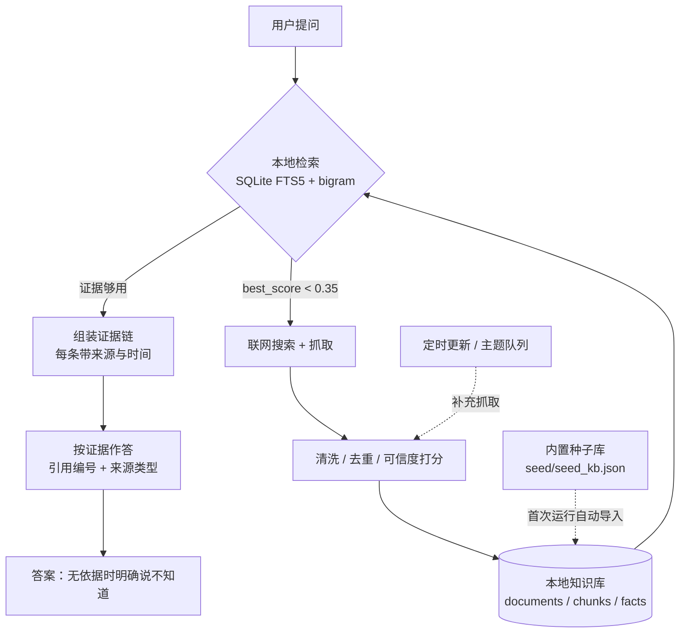

# 架构与数据流（现状速查）

> **文档类型**：现状说明。描述的是**当前代码**的行为，不是提案。
> 代码才是准的，这一页只做入口索引；发现不一致时以代码为准。
> 文档时间：2026-09-23。

这一页回答「这个项目现在是怎么跑的」。
「为什么这样设计、踩过哪些坑」见 [development.md](development.md)（环境、打包与踩坑记录）；
「历史上改过什么」见 `git log` 与提交信息，那里写的是最终结论（过程记录不随仓库分发）。

---

## 1. 这个项目做什么

一个**单机、单用户**的本地知识助手：优先用本地知识库回答关于《异环》
（Neverness to Everness，NTE）的问题；本地证据不足时会联网搜索并抓取，
把新资料写回本地知识库，使**下一次相同提问可以离线回答**。

不含账号体系、不上云、不监听局域网；服务只绑定 `127.0.0.1` 的随机端口。



---

## 2. 运行时拓扑

```
run.py                             ← 打包入口（先建立包上下文，再调 app.main.main）
  └─ app/main.py
       ├─ 选端口         bind(("127.0.0.1", preferred)) → 失败则 bind(("127.0.0.1", 0))
       ├─ uvicorn        承载 app/server/api.py 的 FastAPI 应用（log_config=None）
       ├─ pywebview      原生窗口（子进程探测 WebView2；不可用则降级为默认浏览器）
       └─ 生命周期       首次请求后自动导入种子库、启动更新调度器
```

- **一次性令牌鉴权**：`app/server/api.py` 在启动时生成 `secrets.token_urlsafe(24)`，
  只在 `GET /` 时下发给浏览器（`HttpOnly` + `SameSite=Strict` 会话 Cookie）。
  其余接口都要带令牌，比较用 `secrets.compare_digest`（常量时间）。
  例外：`GET /api/health` 不需要令牌，供就绪轮询用，**只返回 `{"ok": true}`**。
  它本机任何进程都能读，所以不顺带泄露版本与知识库后端形态；版本与 FTS 状态改由
  已鉴权的 `GET /api/state` 提供，界面读的也是那里。
- **Host 白名单**：拒绝非本机 Host 头，防 DNS rebinding。
- **密钥**：Windows DPAPI（`CryptProtectData`）加密后存 `data/config.json`；
  接口只回显掩码；所有日志/异常经 `app/core/secrets.py` 的 `scrub()` 脱敏。
- **探针（「测试连接」「拉取可用模型」）**：这四个接口各服务一个设置分区，体里就是该分区的字段
  （保存接口发的是套一层的 `{llm: {...}}`，探针两种形态都认）。探针只在 `config.detached_copy()`
  的一次性副本上动手，活配置的内存与磁盘都不动；请求体里的 Base URL 只有在**同时带来一把新密钥**
  时才被采用——密钥是请求方自己给的，不存在把用户已存密钥送到外部地址的路径；没带新密钥却要换主机
  （包括只换服务商，地址来自服务端预设表）就明确报错要求重填，而不是悄悄用旧地址。
- **数据目录**：`exe同级/data/`（便携模式）或 `%APPDATA%\NTE-RAG`，
  由 `app/core/paths.py` 判定；只读资源与可写数据严格分开。

---

## 3. 三条主链路

### 3.1 问答链路（`app/core/rag.py`）

```
用户提问
  └─ RagEngine.retrieve()            store.search_facts() + store.search_chunks()
       │                             中文 bigram + SQLite FTS5；bm25 越负越相关
       │                             事实路径按 coverage*0.75 + confidence*0.25 排序
       ├─ 本地够用 ──► build_evidence() ──► answer() / stream_answer() ──► 带引用作答
       └─ best_score < web_trigger_score(默认 0.35)
            └─ RagEngine.web_fill()   search.py 搜索 → fetch.py 抓取 → store_page() 入库
                 └─ build_evidence() 用「本地 + 新抓」的证据一起作答
```

- `build_evidence()` 去重、限长（默认 12000 字符）并按可信度/覆盖度排序。
- `render_context()` 把证据编号成 `[1] [2] …`；模型被要求**只用这些编号**作答，
  资料没覆盖就明说「现有资料未提供…」，不得编造。
- `_citation(item)` 为每条引用补上 URL、来源类型（official/wiki/community/narrative）
  与更新时间；`_offline_answer()` 是未配置模型时的「本地证据直通」模式。
- 每个结论都带来源编号。这是项目的核心承诺，任何优化都不该削弱它。

### 3.2 入库链路（`app/core/ingest.py`）

```
ingest_sources()
  └─ sources.iter_source_pages()     三种连接器：page / list / mw_allpages
       └─ fetch.Fetcher               robots 策略 → 间隔限速 → 退避重试 → 域名冷却
            └─ 正文抽取                Content-Type 优先；JSON 原样解码，HTML 交给
                                      BeautifulSoup + trafilatura；剥 script/style/nav…
                 └─ quality.py         模板噪声、信息密度、视频页、跨作品污染过滤
                      └─ ingest.store_page()     预置黑名单 + 主题相关性闸门 → documents + chunks（分块、SimHash）
                           ├─ store_table_facts()  表格数值 → 结构化条目（extraction=table）
                           ├─ store_api_facts()    MediaWiki 模板 → 原子条目（extraction=api）
                           └─ extract_facts()      规则/LLM 抽条目（extraction=llm）
                                └─ _decide() / _adjudicate()
                                   重复 → 合并；更新 → 新条目 + 旧的标 superseded；
                                   冲突 → 两条并存 + 存疑，绝不覆盖
```

三条设计约束：

1. **不渲染 JavaScript**：只吃 SSR 页面与公开 JSON API（官方衍生作品指引禁止搬运美术资源，
   仓库因此不含任何位图素材，界面全部代码绘制）。
2. **结构化字段优先于表格**：BWIKI 条目模板里的数值在渲染页面上根本不出现，
   所以走 `app/core/wiki_api.py` 的 `action=query&prop=revisions` 批量接口
   （一次 20 个标题），既是精度需要也是绕 WAF 的需要。
3. **改数据不等于改结论**：新资料与旧结论冲突时不覆盖，并存 + 标注生效时间。

### 3.3 更新链路（`app/core/autoupdate.py` + `ingest.update_topic()`）

```
触发源：开机自动 / 定时 / 界面手动 / 主题队列（topic_queue 表）
  └─ 取 topic_queue 中的关键词（dequeue_topics）
       └─ 走「搜索 → 抓取 → 入库」同一条链路（ingest.update_topic）
            └─ update_logs 表记录当次更新：抓取数、质量过滤数、失败跳过数、新增条目数
```

- 抓取失败**不静默**：被 WAF 拦（如 HTTP 567/429）会让**整个域名冷却 10 分钟**，
  时长是 `config.json` 里的 `fetch.cooldown_seconds`；每一页的失败原因都会写进更新报告。
- **robots 与限速取保守取向**：读不到 `robots.txt`（网络错误/403/超时/5xx）时跳过该站；
  明确 404 或 200 空文件都等于「没有声明规则」，按允许抓取处理（RFC 9309）。
  站点声明的 `Crawl-delay` 睡满，超过 30 秒就跳过该页。
  冷却与同域间隔是**模块级共享状态**，更新器挣来的冷却对聊天里的联网补充同样生效。
- **入库有四道默认闸门**（`app/core/quality.py` 与 `app/core/curation.py`，用户无需配置即生效）：
  撤回名单（复核判定为伪造或不可信的**具体页面**，写入前直接拒收，不分来源类型）、
  预置黑名单（字词/字典站与视频页，抓之前就跳过）、主题相关性（社区来源的页面，
  标题或正文里连一个主题词都没有就丢弃；主题词取各更新主题的共有词，交集为空时闸门失效）、
  用户黑名单（搜索、抓取、入库三处都跳过）。手动添加的来源只受撤回名单与主题闸门约束，
  官方站与 wiki 站不受主题闸门约束。
- **撤回名单在启动时补跑一次迁移**：名单指纹存在库的 meta 里，与当前名单不一致时，
  命中页面对应的 documents/chunks/facts 会被置为 `revoked`（`KnowledgeBase.revoke_source()`，
  软撤回，记录留在库里供复核），检索层只读 `active`/`conflict`，所以老版本留下的内容
  在升级后同样会从答案里消失（`app/core/curation.py`、`AppContext.ensure_curation()`）。
- 每个请求都有**整体时限**（不是分阶段超时）：慢速滴流的响应体读到预算耗尽即放弃；
  模型调用按 `Retry-After` 退避、带抖动、只重试可重试的传输错误与状态码。
- 更新报告的六个计数各有含义：**取到正文**＝该轮取回正文的页数（含随后被清洗层丢弃的），
  **新页面**＝实际写进库里或内容有更新的页数，**内容未变**＝同一页重复抓到且内容没变，
  **按 robots/黑名单规则跳过**＝主动不抓（不是失败），**过滤**＝抓到了但判为垃圾或与主题无关，
  **抓取失败**＝根本没抓到。`取到正文 = 新页面 + 过滤 + 内容未变`。
  排查数据缺口先看「抓取失败」。
- **构建期**（`tools/seed_builder.py:290-302`）有防退化：新一轮构造出的条目数少于上一次种子时
  不覆盖，改另存 `seed_kb.partial.json`（可用 `--allow-shrink` 强制）；
  **运行时的 `load_seed`（`app/core/ingest.py:1257-1378`）没有这层保护**，它只按种子文件指纹
  决定要不要导入，外加新增的「逐条导入有失败就不写指纹、下次重试」，以及按撤回名单
  跳过已证伪页面（种子文件本身不改，理由见 §6）。

---

## 4. 可信度与一致性

### 4.1 可信度是推导出来的，不是模型自报的（`app/core/trust.py`）

```
trust = 0.45 × 来源等级      official 1.0 / manual 0.95 / wiki 0.75 / seed 0.6 / community 0.5
      + 0.25 × 提取方式      api 1.0 / manual 0.95 / table 0.85 / llm 0.6
      + 0.20 × 跨源一致      multi 1.0 / single 0.6 / conflict 0.2
      + 0.10 × 时效          6 个月内 1.0 / 一年内 0.7 / 更早 0.4 / 无日期 0.7
                             （版本、活动、价格、保底等时效性字段额外 ×0.7）
```

推理过程写进条目的 tags，例如
`提取:table 可信度:0.74(来源0.75/提取0.85/一致0.60/时效0.70)`；
第二个独立来源确认再加 `+0.08` 并标 `多源确认`。
可信度参与检索排序（bm25 接近时 `coverage*0.75 + trust*0.25`）。

### 4.2 跨源比对与冲突（`app/core/consistency.py`，报告 `tools/consistency_report.py`）

- 按 `(实体, 字段)` 归槽，比较**数值签名**；按**域名**分组投票。
- `len(by_domain) >= 2` 且签名不同 → `conflict`（一致度 1.0 → 0.2），两条都保留。
- **不跨定义比对**：`生命/攻击` 这类字段一旦冲突即标存疑、退出投票池，
  不再参与比对（施工期数据不可比，全局给 BWIKI 降权会误伤已经稳定的字段）。
- 纯叙事文本（官方「角色介绍」）单独成类**叙事/世界观来源**，不参与任何字段投票。
- 当前种子库：多源一致 14（全部为生日）、冲突 0；投票面 74 槽。
  唯一一处分歧（薄荷·生日）已人工裁定，判例见 [consistency_review.md](consistency_review.md)。

### 4.3 时效与版本（`app/core/versioning.py`）

- 只接受「正文里带年份的完整日期」或链接中的 `/YYYYMMDD/`；
  链接年份 + 正文「8月13日」可重建出确切日期；跨年、含糊一律留空，不猜。
- 区分**生效日**（`生效于 2026-08-13`）与**发布日**（`发布于 2026-08-08`）；
  两者混为一谈会输出假信息。
- 同一 `(实体, 字段)` 多行时，生效时间/版本更新的排在证据前面，旧版本仍留在证据里。

---

## 5. 数据存储（`app/core/store.py`，SQLite，`SCHEMA_VERSION = 3`）

| 表 | 作用 |
|---|---|
| `meta` | 键值元信息（含 `schema_version`） |
| `documents` | 抓取到的页面：URL、标题、来源类型、状态、时间 |
| `chunks` | 分块正文 + SimHash ± 可选向量；`chunks_fts` 是 FTS5 索引 |
| `facts` | 原子知识条目：主题/标签/可信度/extraction/version/effective_from/date_kind/sim_bucket；`facts_fts` 是 FTS5 索引 |
| `update_logs` | 每轮更新的计数与结果（界面「更新报告」的数据源） |
| `topic_queue` | 待更新主题队列（自动/手动） |

索引：`idx_documents_source`、`idx_documents_updated`、`idx_chunks_doc`、
`idx_facts_topic`、`idx_facts_status`、`idx_facts_title`、`idx_facts_bucket`。

- 老库自动补列（`_migrate()`）+ 回填 `sim_bucket`；`ALTER TABLE` 之前不能建依赖新列的索引。
- `status` 有四种：`active`、`conflict`、`superseded`、`revoked`。检索只读前两种，
  所以撤回名单把已证伪页面标成 `revoked` 就能让它同时退出切片与条目检索，记录仍留在库里可复核。
- 检索是**纯词法**匹配：`app/core/chunk.py` 把中文切成 bigram、英文/数字整词保留，
  再拼成 FTS5 `MATCH` 串。因此**中英跨语言检索不通**，
  详见 README 首屏的 Chinese-first 说明。
- 可选向量检索（embeddings API）默认关闭，仅作为增强。

---

## 6. 代码导航

| 想改什么 | 看哪个文件 |
|---|---|
| 加/删数据源、改抓取入口 | `app/core/sources.py`（`DEFAULT_SOURCES` + 三种连接器） |
| MediaWiki 模板 → 结构化条目 | `app/core/wiki_api.py` |
| 抓取策略（robots、限速、退避、冷却） | `app/core/fetch.py` |
| 垃圾过滤、预置黑名单、主题相关性闸门 | `app/core/quality.py` |
| 已证伪页面的撤回名单与迁移 | `app/core/curation.py` |
| 分块/分词/SimHash | `app/core/chunk.py` |
| 入库决策（新增/更新/冲突） | `app/core/ingest.py`（`_decide` / `_adjudicate`） |
| 重复判定 | `app/core/dedupe.py` |
| 可信度公式 | `app/core/trust.py` |
| 跨源投票 | `app/core/consistency.py` |
| 日期/版本抽取 | `app/core/versioning.py` |
| 检索与排序 | `app/core/store.py`（`search_facts` / `search_chunks`） |
| 问答链路与提示词 | `app/core/rag.py` |
| HTTP 接口 | `app/server/api.py` |
| 界面 | `app/web/index.html` / `style.css` / `app.js` |
| 自检断言（698 项） | `tools/quality_check.py` |
| 版本资源与发布件 | `tools/make_version_info.py` / `tools/build_exe.ps1` |

---

## 7. 移植到其它游戏/主题

这套流程本身与题材无关，需要改的是：

1. `app/core/sources.py` 的 `DEFAULT_SOURCES`（站点目录与连接器）；
2. `app/config.py` 的默认主题词/推荐问题；
3. `seed/seed_kb.json`（可用 `tools/seed_builder.py` 重建）；
4. 若新题材有第四种页面结构，可能需要在 `app/core/` 加一个连接器或解析器。

检索层（bigram + FTS5）、可信度推导、一致性投票、问答链路**无需改动**。
数据源的 robots、限速与版权政策逐站不同，换源时要重做一次可爬性验证
（逐站的 robots 原文与实测结论记在 [data_sources_cn.md](data_sources_cn.md)）。

---

## 8. 相关文档

| 文档 | 何时看 |
|---|---|
| [README.md](../README.md) | 安装、使用、FAQ、已知限制 |
| [development.md](development.md) | 环境搭建与依赖、运行调试、打包与发布、平台适配、踩坑记录 |
| [consistency_review.md](consistency_review.md) | 跨源一致性判例档案（含唯一分歧的裁定过程） |
| [data_sources_cn.md](data_sources_cn.md) | 各站点可爬性、抓取参数与结论 |
| [THIRD_PARTY_NOTICES.md](../THIRD_PARTY_NOTICES.md) | 第三方数据来源与版权归属 |
| [../eval/README.md](../eval/README.md) | 评测集结构与打分方式 |
